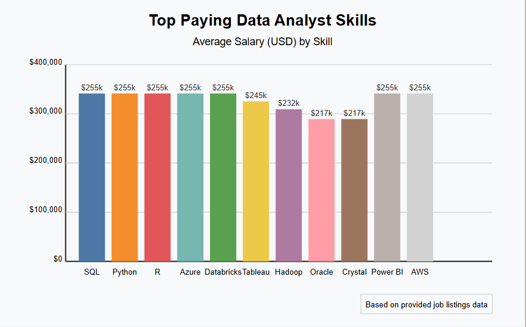

# Introduction
📊 Welcome to my SQL Projects Portfolio! This repository showcases a collection of real-world SQL projects focusing on data analyst roles, this project explores 💰 top-paying jobs, in-demand skills.

🔍SQL Queries? Check them out here: [SQL Queries](/SQL%20Queries/)


# 🔍 Background

The demand for data professionals—especially Data Analysts—continues to grow across industries. With vast amounts of job postings available online, understanding which skills are most sought-after and which roles offer competitive salaries can help aspiring analysts focus their learning effectively.

This project dives into job market data to answer key questions such as:
- What are the top-paying roles for Data Analysts?
- Which technical skills are most in demand for remote analyst positions?
- How do skillsets correlate with average salaries across job listings?

By using SQL to join, filter, group, and analyze job posting datasets, this project delivers actionable insights for career planning and data-driven decision-making. It also showcases the power of SQL in transforming raw data into meaningful information.


# 🛠️ Tools I Used

- **PostgreSQL** – Used as the primary database for querying and analyzing the data.
- **Visual Studio Code (VS Code)** – My go-to code editor for writing and testing SQL queries with extension support for PostgreSQL and SQL syntax highlighting.

These tools provided a powerful and efficient environment for exploring data, building queries, and drawing insights from structured datasets.

#  The Analysis
Each query for this project aimed at investigating specific aspects of the example data analyst job market dataset:

### 1. Top Paying Data Analyst Jobs:
- To identify top paying jobs I filtered Data Analyst Positions by average yearly salary and location, focusing on work from home jobs. This query highlights top paying data analyst job that offers work from home.

```sql
SELECT
    job_id,
    job_title,
    company_dim.name,
    job_location,
    job_schedule_type,
    salary_year_avg,
    job_posted_date
FROM
    job_postings_fact
    LEFT JOIN company_dim
    ON job_postings_fact.company_id = company_dim.company_id

WHERE
    job_title_short = 'Data Analyst' AND
    job_work_from_home = true AND
    salary_year_avg IS NOT NULL

ORDER BY 
    salary_year_avg DESC

LIMIT 10

```
Here are the breakdowns of the query above:
- 💼 **Senior and leadership roles** (e.g., Director, Principal Analyst) command the highest salaries, reflecting the value of experience and strategic impact in data-driven decision-making.  
- 🏢 **Top-tier companies** like Meta, AT&T, and Pinterest offer premium compensation, especially for roles tied to business insights and product analytics.  
- 🌍 **Remote and hybrid roles** dominate the high-paying list, highlighting flexibility as a standard in modern, high-level data analyst positions.


*Bar graph visualing the salary for the top 10 salaries for data analysts; ChatGPT generated this graph for my SQL Query results*

## 2. Skills for Top Paying Jobs
- To identify the skills for top paying jobs I joined job postings data with skills data providing emplpoyers value for high-compensation roles.

```sql
-- identifying top paying job skills from the previous table using CTE --
WITH top_paying_jobs AS (
SELECT
    job_id,
    job_title,
    company_dim.name,
    job_location,
    job_schedule_type,
    salary_year_avg,
    job_posted_date
FROM
    job_postings_fact
    LEFT JOIN company_dim
    ON job_postings_fact.company_id = company_dim.company_id

WHERE
    job_title_short = 'Data Analyst' AND
    job_location = 'Anywhere' AND
    salary_year_avg IS NOT NULL

ORDER BY 
    salary_year_avg DESC

)

SELECT
    skills_dim.skills,
    top_paying_jobs.*
FROM top_paying_jobs
INNER JOIN skills_job_dim AS skill_to_job
    ON top_paying_jobs.job_id = skill_to_job.job_id
INNER JOIN skills_dim
    ON skill_to_job.skill_id = skills_dim.skill_id

ORDER BY 
    salary_year_avg DESC

LIMIT 25
```
Here are the breakdowns of the query above:


*Bar graph visualing the salary for the top 10 salaries for data analysts; ClaudeAI generated this graph for my SQL Query results*

## 3. Top Demanding Skills
- To identify top demanding skills I COUNT() job_ids from job postings and merge with skills_dim table to clearly identify the skills needed.

```sql

SELECT 
    skills,
    COUNT(skill_to_job.job_id) AS demand_count

FROM job_postings_fact
INNER JOIN skills_job_dim AS skill_to_job
    ON job_postings_fact.job_id = skill_to_job.job_id
INNER JOIN skills_dim
    ON skill_to_job.skill_id = skills_dim.skill_id

WHERE
    job_title_short = 'Data Analyst'

GROUP BY
    skills

ORDER BY
    demand_count DESC

LIMIT 5


```
| Skill    | Demand Count |
|----------|-------------|
| SQL      | 92,628      |
| Excel    | 67,031      |
| Python   | 57,326      |
| Tableau  | 46,554      |
| Power BI | 39,468      |

The demand pattern suggests that a well-rounded data analyst should be proficient in:
- Data extraction and manipulation (SQL, Python)
- Reporting and analysis (Excel)
- Visualization and presentation (Tableau, Power BI)

To stay competitive in the job market, aspiring or current data analysts should focus on strengthening these core skills, 
particularly SQL and Python, while also developing capabilities in visualization tools to meet industry expectations.

## 4. Top Paying Skills
- To identify the top paying skills I filtered the top skills with average yearly salary, that also gives the opportunity to do work from home.

```sql

SELECT
    skills_dim.skills,
    ROUND(AVG(salary_year_avg), 0) AS avg_salary

FROM
    job_postings_fact
INNER JOIN skills_job_dim
    ON job_postings_fact.job_id = skills_job_dim.job_id
INNER JOIN skills_dim
    ON skills_job_dim.skill_id = skills_dim.skill_id

WHERE
    job_title_short = 'Data Analyst'
    AND salary_year_avg IS NOT NULL 
    AND job_work_from_home = true

GROUP BY
    skills_dim.skills

ORDER BY
    avg_salary DESC

LIMIT 10

```

| Skill         | Average Salary ($) |
|---------------|-------------------|
| PySpark       | 208,172           |
| Bitbucket     | 189,155           |
| Watson        | 160,515           |
| Couchbase     | 160,515           |
| DataRobot     | 155,486           |
| GitLab        | 154,500           |
| Swift         | 153,750           |
| Jupyter       | 152,777           |
| Pandas        | 151,821           |
| Elasticsearch | 145,000           |

Here is the breakdown of the table above:
- Big Data & ML Tools Pay Big: Skills like PySpark, Databricks, and DataRobot show that data analysts who can work with large-scale data 
and machine learning pipelines earn significantly more.

-  Cloud & DevOps Integration is Essential: Knowledge of cloud platforms (GCP, Kubernetes) and CI/CD tools (GitLab, Jenkins) boosts salaries, 
as analysts increasingly work in production environments.

- Beyond Basics: Programming & Engineering Skills Win: Mastery of Python libraries (Pandas, NumPy), advanced databases (PostgreSQL, Elasticsearch), 
and cross-functional tools positions analysts for top-tier roles.

## 5. Top Paying Optimal Skills
- To identify the most demanding skills that matches with high paying opportunity in Data analyst Role I aggregate **AVG()** the yearly salary and **COUNT()** the job id as job demand count from job postings data. And merge it with the skills data to clearly show the appropriate skills for any job postings.

```sql
/*
Question:
Combining the Query no.3 and no.4 to get the most optimal skills
which is (high demand and high paying skills)
*/


WITH skill_demand AS (
SELECT 
    skills_dim.skill_id,
    skills_dim.skills,
    COUNT(skill_to_job.job_id) AS demand_count

FROM job_postings_fact
INNER JOIN skills_job_dim AS skill_to_job
    ON job_postings_fact.job_id = skill_to_job.job_id
INNER JOIN skills_dim
    ON skill_to_job.skill_id = skills_dim.skill_id

WHERE
    job_title_short = 'Data Analyst' 
    AND job_work_from_home = true
    AND salary_year_avg IS NOT NULL

GROUP BY
    skills_dim.skill_id


), average_salary AS (
SELECT
    skills_dim.skill_id,
    skills_dim.skills,
    ROUND(AVG(salary_year_avg), 0) AS avg_salary

FROM
    job_postings_fact
INNER JOIN skills_job_dim
    ON job_postings_fact.job_id = skills_job_dim.job_id
INNER JOIN skills_dim
    ON skills_job_dim.skill_id = skills_dim.skill_id

WHERE
    job_title_short = 'Data Analyst'
    AND salary_year_avg IS NOT NULL 
    AND job_work_from_home = true

GROUP BY
    skills_dim.skill_id

)

SELECT
    skill_demand.skill_id,
    skill_demand.skills,
    demand_count,
    avg_salary

FROM
    skill_demand
INNER JOIN
    average_salary ON
    skill_demand.skill_id=average_salary.skill_id

WHERE
    demand_count > 10

ORDER BY
    avg_salary DESC,
    demand_count DESC

LIMIT 25


--rewriting in more concise query without using CTEs

SELECT
    skills_dim.skill_id,
    skills_dim.skills,
    COUNT(skill_to_job.job_id) AS demand_count,
    ROUND(AVG(job_postings_fact.salary_year_avg), 0) AS average_salary

FROM
    job_postings_fact
INNER JOIN skills_job_dim as skill_to_job
    ON job_postings_fact.job_id = skill_to_job.job_id
INNER JOIN skills_dim
    ON skill_to_job.skill_id = skills_dim.skill_id

WHERE
    job_title_short = 'Data Analyst'
    AND salary_year_avg IS NOT NULL -- where can't use alias in conditions --
    AND job_work_from_home = True

GROUP BY
    skills_dim.skill_id

HAVING
    COUNT(skill_to_job.job_id) > 10 --having can't use alias in conditions--

ORDER BY
    average_salary DESC,
    demand_count DESC

LIMIT 25

```
| Skill | Demand Count | Average Salary ($) |
|-------|-------------|-------------------|
| Go | 27 | 115,320 |
| Confluence | 11 | 114,210 |
| Hadoop | 22 | 113,193 |
| Snowflake | 37 | 112,948 |
| Azure | 34 | 111,225 |
| BigQuery | 13 | 109,654

Here are the insights from the breakdown above:

- **High-paying roles favor cloud, big data, and engineering skills** like Go, 
    Snowflake, Hadoop, and AWS—indicating demand for analysts with modern data infrastructure knowledge. 
- **Core analytics tools** such as Python, SQL, R, and Tableau remain the most in-demand, 
    forming the foundation for most data analyst roles.  
- **Specialized or emerging tools** (e.g., BigQuery, Looker, Confluence) offer 
    premium salaries despite lower demand, making them valuable differentiators.

#  What I learned
Throughout making this project as a computer engineering graduate trying to go into data analytics:

- **🧩 Complex Query Crafting: ** I learned thoroughly the advanced SQL function, merging tables, and using CTEs for more advance table merging.

- **📈 Data Aggregation: ** I can say I am comfortable on using GROUP BY and turned aggregate functions like COUNT() and AVG as my asernal in data summarizing.
- **🤯 Analytical Skill: ** With practive problems I found in different courses and internet like. I came up to answer different questions using different dataset to show my analytical skills.

#  Conclusions

After analyzing the data analyst job market through SQL queries, several key patterns emerged that offer valuable guidance for aspiring and current data professionals:
Key Findings

1. **Core Skills Remain Essential:** SQL, Excel, Python, Tableau, and Power BI consistently dominate demand across job postings, forming the fundamental toolkit every data analyst should master.

2. **Specialized Skills Command Premium Salaries:** Technologies like PySpark, Snowflake, and Hadoop offer significant salary boosts (>$110K), highlighting the value of big data and cloud expertise in today's market.

3. **Remote Work Premium:**  The highest-paying analyst positions frequently offer work-from-home options, suggesting that remote flexibility and higher compensation often go hand-in-hand.

4. **Strategic Career Pathing:** The data reveals clear progression paths where developing specific skill combinations (like Python + cloud technologies) can strategically position analysts for higher-paying opportunities.

5. **Emerging Technologies Matter:** Tools like Go, Confluence, and DataRobot appear less frequently but command top salaries, indicating valuable differentiation opportunities for analysts willing to invest in developing expertise in these areas.

## 🚀Future Opportunities
- This analysis demonstrates the power of SQL in extracting actionable insights from job market data. The findings can help guide learning priorities, skill development paths, and career strategies for data professionals seeking to maximize their market value and career opportunities.
As the data landscape continues to evolve, ongoing analysis of these trends will remain valuable for staying competitive in the rapidly changing field of data analytics.