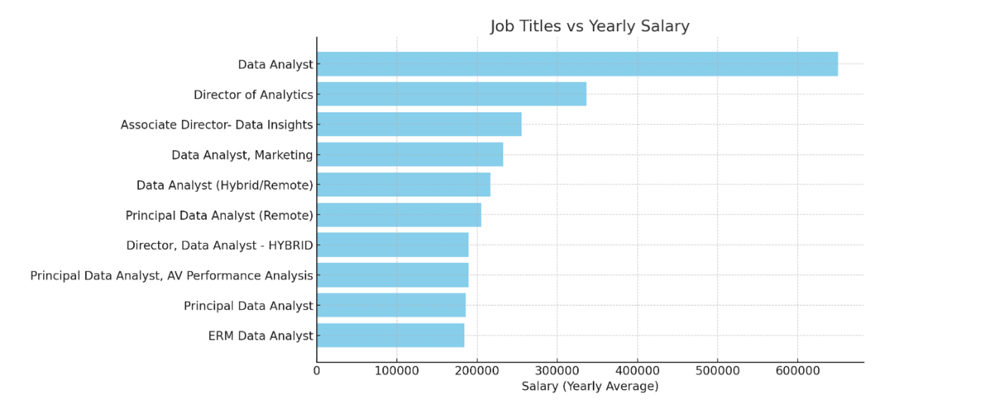

# Introduction
📊 Welcome to my SQL Projects Portfolio! This repository showcases a collection of real-world SQL projects focusing on data analyst roles, this project explores 💰 top-paying jobs, in-demand skills.

🔍SQL Queries? Check them out here: [SQL Queries](/SQL%20Queries/)


# 🔍 Background

The demand for data professionals—especially Data Analysts—continues to grow across industries. With vast amounts of job postings available online, understanding which skills are most sought-after and which roles offer competitive salaries can help aspiring analysts focus their learning effectively.

This project dives into job market data to answer key questions such as:
- What are the top-paying roles for Data Analysts?
- Which technical skills are most in demand for remote analyst positions?
- How do skillsets correlate with average salaries across job listings?

By using SQL to join, filter, group, and analyze job posting datasets, this project delivers actionable insights for career planning and data-driven decision-making. It also showcases the power of SQL in transforming raw data into meaningful information.


# 🛠️ Tools I Used

- **PostgreSQL** – Used as the primary database for querying and analyzing the data.
- **Visual Studio Code (VS Code)** – My go-to code editor for writing and testing SQL queries with extension support for PostgreSQL and SQL syntax highlighting.

These tools provided a powerful and efficient environment for exploring data, building queries, and drawing insights from structured datasets.

#  The Analysis
Each query for this project aimed at investigating specific aspects of the example data analyst job market dataset:

### 1. Top Paying Data Analyst Jobs:
- To identify top paying jobs I filtered Data Analyst Positions by average yearly salary and location, focusing on work from home jobs. This query highlights top paying data analyst job that offers work from home.

```sql
SELECT
    job_id,
    job_title,
    company_dim.name,
    job_location,
    job_schedule_type,
    salary_year_avg,
    job_posted_date
FROM
    job_postings_fact
    LEFT JOIN company_dim
    ON job_postings_fact.company_id = company_dim.company_id

WHERE
    job_title_short = 'Data Analyst' AND
    job_work_from_home = true AND
    salary_year_avg IS NOT NULL

ORDER BY 
    salary_year_avg DESC

LIMIT 10

```
Here are the breakdowns of the query above:
- 💼 **Senior and leadership roles** (e.g., Director, Principal Analyst) command the highest salaries, reflecting the value of experience and strategic impact in data-driven decision-making.  
- 🏢 **Top-tier companies** like Meta, AT&T, and Pinterest offer premium compensation, especially for roles tied to business insights and product analytics.  
- 🌍 **Remote and hybrid roles** dominate the high-paying list, highlighting flexibility as a standard in modern, high-level data analyst positions.


*Bar graph visualing the salary for the top 10 salaries for data analysts; ChatGPT generated this graph for my SQL Query results*

## 2.


#  What I learned
#  Conclusions
